## What is this?

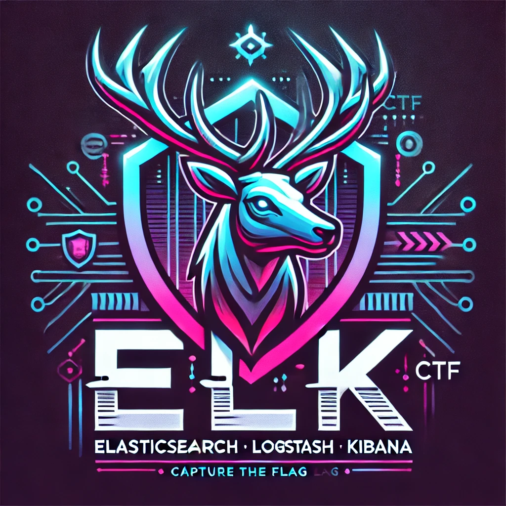

Kibana CTF is an open source Kibana CTF challenge simulation using the open source product [CTFd](https://ctfd.io/) and the Elastic stack. This project is designed to modularize challenges so new challenges can be add in the future. To date, there are 14 challenges. This project includes a script as you will see below that allows you to create a local CTFd instance and a local Elastic stack for trying out this CTF! In theory, the script can be used to import the challenges into your own CTFd instance or Elastic instance, but be warned that it could overwrite or cause undesired consequences to those instances if not careful. It is recommend that you use the script to spin up a unique localized instance using Docker and the steps below to perform this CTF. Please open any issues that you may find. Enjoy!

_Features_:
- [x] Discover challenges
- [x] ES|QL challenges
- [x] Optimize challenge scores, play through ensure good flow
- [x] Ensure all saved objects and elasticsearch docs can be replicated with ease.
- [x] Document deploy/setup instructions
- [x] Assisted setup with PowerShell 7 script
- [ ] Add ability to randomize flags for unique flags every time
- [ ] Share with community!

## Requirements
- PowerShell 7+ (For Setup [Manual/Automated])
- Elastic Stack (Kibana and Elasticsearch 8.16+) -> Can be retrived using included script!
- CTFd (Latest) -> Can be retrived using included script!

```
 ./Invoke-Kibana-CTF-Setup.ps1                                                                                                       
Welcome to the Kibana CTF Setup Script!
What would you like to do?
1. Deploy CTFd
2. Deploy Elastic Stack
3. Import Elastic Stack Challenges
4. Reset CTFd
5. Reset Elastic Stack
6. Check for Requirements
7. Deploy all from scratch (Use with Caution as it runs through the entire process.)

Q. Quit
Enter your choice: 
```

## How to get started
1. Ensure you have PowerShell 7+ installed then download this repo to get rolling!

```bash
git clone https://github.com/nicpenning/kibana-ctf.git
cd kibana-ctf
pwsh
./Invoke-Kibana-CTF-Setup.ps1
```

2. Deploy CTFd - Use Option 1

    a. Once deployed, go to the CTFd instance and navigate through the wizard with default settings (most of these will be overwritten later). Make sure to make note of your admin user/password combination and specify how long you want the CTF to last (this can easily be changed later if needed.)

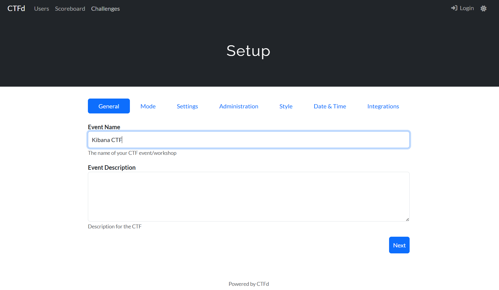
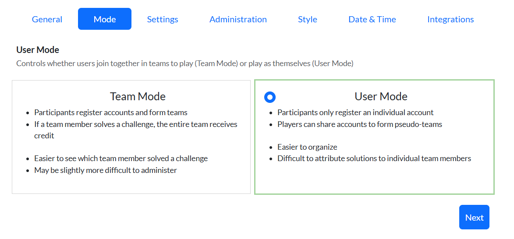
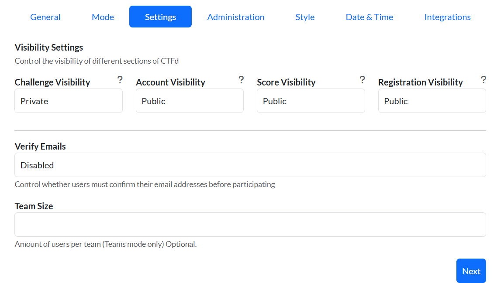
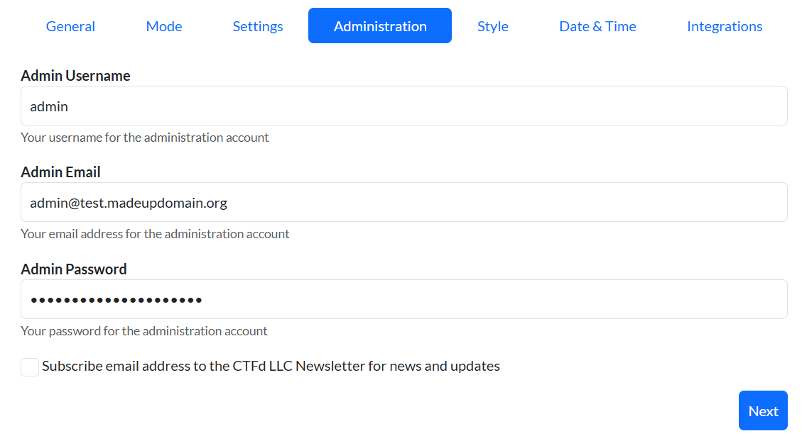
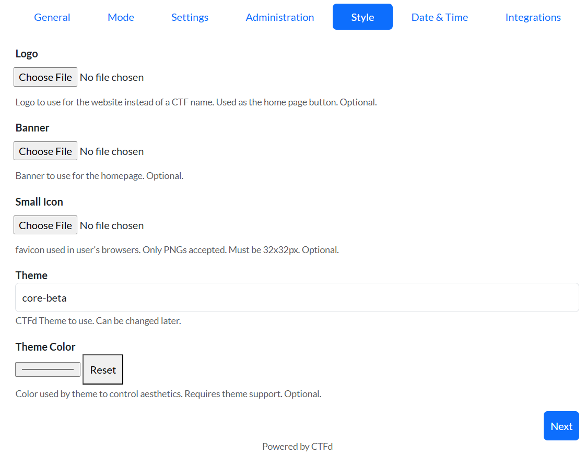
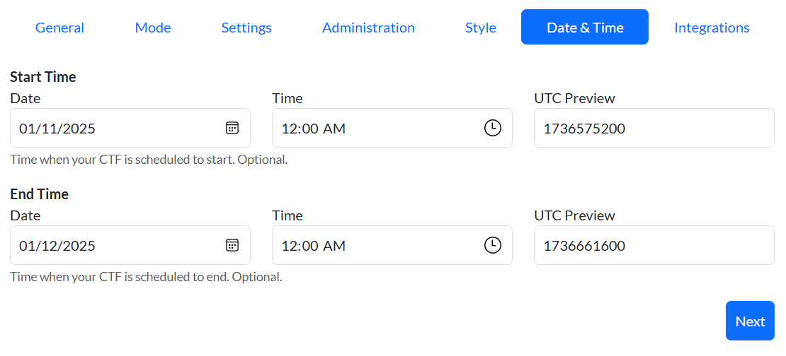
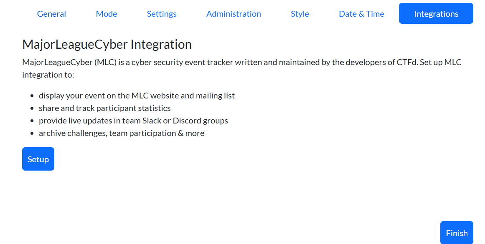

    b. Go to settings, create the API Access Token and copy for later since you will not be able to see them after dismissing that pop up window. (No worries if you forget, you can create one later.)

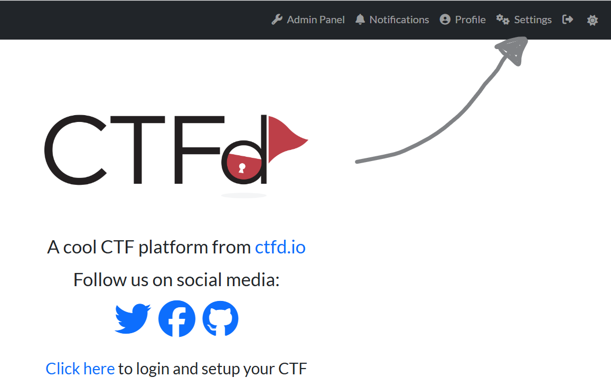
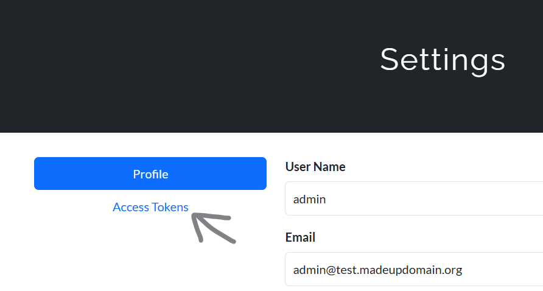
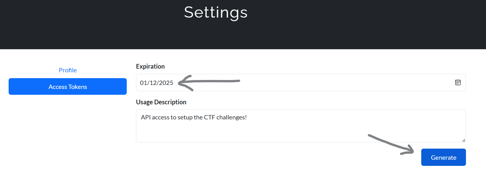
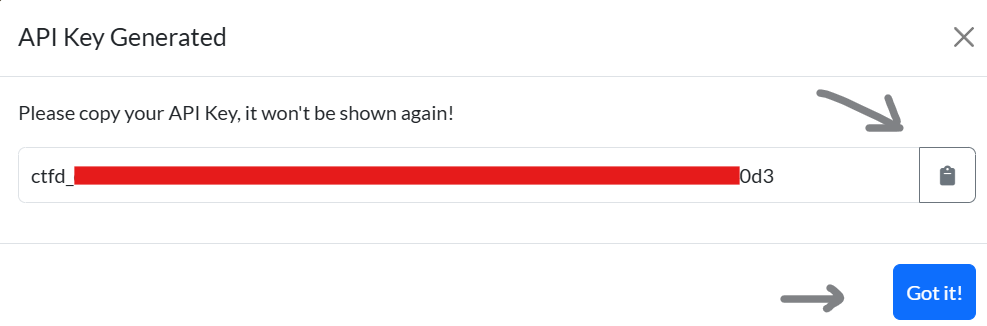

3. Import CTFd Challenges/Flags/etc. - Use Option 2 (This will ask for you Access Token we had you copy from the previous step!)

    a. Make sure to create a user in CTFd for doing the CTF instead of using the admin account. Navigate to http://127.0.0.1:8000/register to create your account.

    b. Once the account is created go ahead and login. The setup for the CTF is complete, now you just need to get Elastic up and going by proceeding to the next step.

4. Download and start Elasticsearch / Kibana - Use Option 4

5. Import Objects and Index Documents for Elastic Stack - Use Option 5

6. Login to Kibana and go to the Kibana CTF space and good luck!

#### Advanced Settings for CTFd access - Allow others on the network to access CTF
Note: You can grab the Ubuntu IP by running this from your Ubuntu WSL2 host: `ip addr | grep eth0`:
```bash
2: eth0: <BROADCAST,MULTICAST,UP,LOWER_UP> mtu 1500 qdisc mq state UP group default qlen 1000
    inet **172.25.93.23**/20 brd 172.25.95.255 scope global eth0
25: veth06010d4@if24: <BROADCAST,MULTICAST,UP,LOWER_UP> mtu 1500 qdisc noqueue master br-765cf15dc8a1 state UP group default
```

```Powershell
netsh interface portproxy add v4tov4 listenport=31337 listenaddress=[Replace this with your local IP. Example == 192.168.86.90] connectport=8000 connectaddress=[Replace this with your WSL2 IP. Example == 172.25.93.23]
```
Doing the step above then allows access to your computer from http://192.168.86.90:31337 since it will forward any traffic from other devices to the WSL2 IP of 172.25.93.24:8000 (which you can access locally). Just becareful not to do this on public networks. Do this at your own risk.

If you have a Windows Firewall enabled, you will need to allow the port used above (ie TCP 31337).

#### Modular Challenge Structure
Challenges are stored in the `challenges` and each challenge is part of a category and contains files necessary to build the challenge in CTFd and the populate the challenge in the Elastic stack. Don't look at this files if you wish to challenge yourself! These challenges are modular so more can be added later or tweaked as needed. Inside of the challenges directory, there are files as follows:

```
Discover/
├── (Challenge Number)/
│   ├── ctfd_challenge.md ---> This is the shell of the challenge that includes the name, description, value, etc. which will be stored in CTFd. (Required)
│   ├── ctfd_flag.json ---> This is the actual flag used in CTFd. (Required)
│   ├── ctfd_hint.json ---> This is the hint for the challenge in CTFd. (Optional)
│   ├── elastic_import_script.ps1 ---> This is a specialized PowerShell script used to create the contents for a challenge. (Optional)
│   └── elastic_saved_objects.json ---> These are the saved objects that are imported into the Elastic stack for the challenge. (Optional)
```
